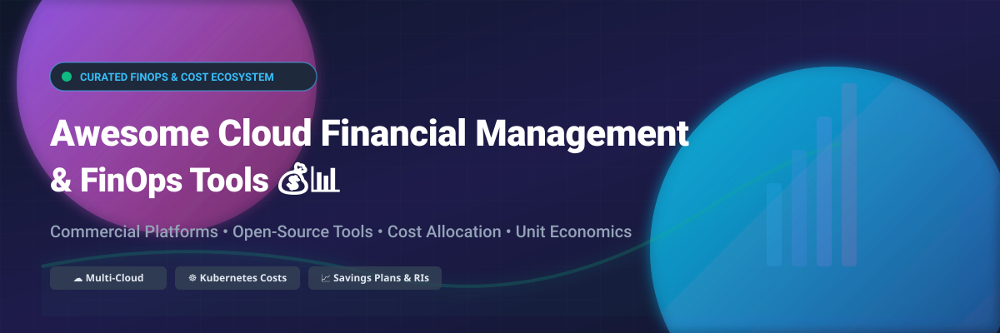

# Awesome-Cloud-Financial-Management-Finops

# Awesome-Cloud-Financial-Management-Finops 💰 📊



  





  
  
  
  
  
  



---

## 🌟 Top Cloud Financial Management (FinOps) Ecosystem

**Curated List of Commercial FinOps Platforms & Open-Source Cost Management Tools**  
*Focused on Cost Visibility, Showback/Chargeback, Unit Economics, Commitment Optimization, Anomaly Detection & Self-Hosted FinOps Automation*

**Last updated: October 2026** 📅

---

### 📌 Overview & SEO Summary
Welcome to the ultimate curated directory of **cloud financial management platforms**, **open-source FinOps tools**, and **cost optimization frameworks**. Whether you are looking for enterprise-grade commercial solutions (such as *CloudZero*, *Finout*, and *Apptio Cloudability*), or self-hostable open-source alternatives (like *OpenCost*, *Kubecost*, and *Infracost*), this list covers category leaders, unit economics engines, and privacy-respecting cost governance.

---

## 📑 Table of Contents
- [🏢 SaaS & Commercial Platforms](#-saas--commercial-platforms)
- [🔓 Open-Source GitHub Projects](#-open-source-github-projects)
- [🛠️ How to Contribute](#%EF%B8%8F-how-to-contribute)
- [📊 Star History](#-star-history)
- [🤝 Support & Sponsorship](#-support--sponsorship)
- [⚠️ Disclaimer](#%EF%B8%8F-disclaimer)

---

## 🏢 SaaS / Commercial Platforms

The FinOps platform market spans **free native cloud tools** (AWS Cost Explorer, Azure Cost Management, GCP Cost Management) that provide baseline visibility at no cost, and **specialized platforms** that charge as a percentage of managed spend or per-resource fees. **CloudZero** differentiates through **unit economics** — measuring cost per customer, per team, or per feature — and uses a **usage-based model** where hidden costs include **Professional Services ($5K–$15K)** and **Premium Support (15–25% uplift)** . **Finout** starts near **$6,000/year** and covers AWS, Azure, GCP, Kubernetes, Snowflake, and Datadog without requiring tagging cleanup first . **Apptio Cloudability** allocates **100% of cloud costs including containers, support, and shared services**, with overage fees from **$1,930 (Essentials) to $4,410 (Premium) per unit** . **Vantage** offers a **free tier for 2 accounts and 10 cost reports**, with Pro at **$30/month + 3% of managed spend** . **Kubecost** provides a **free tier with unlimited clusters but a $100K spend cap**, while the EKS-optimized bundle is **free with no spend cap** . **Harness CCM** offers a **Free Forever tier** for organizations under **$250K/year cloud spend**, with Enterprise SKUs for Commitment Orchestrator and AutoStopping . **Anodot** charges **$40,000–$100,000/year** for multi-use deployments with **15–30% multi-year discounts** . **Ternary** uses a **flat-rate pricing model based on cloud spend bands** with multi-year discounts up to **7.5%** — the most transparent enterprise pricing model . **Spot by NetApp (Flexera)** charges **$1.415 per 100 vCPU hours** for managed compute, with a free tier covering up to **20 VMs** .

| SaaS / Commercial Platform | Company / Owner | Valuation / Market Cap | Standard Edition Starting Price | Free Tier / Free Trial Limits | Description |
| :--- | :--- | :--- | :--- | :--- | :--- |
| **[AWS Cloud Financial Management](https://aws.amazon.com/aws-cost-management/)** ☁️ | Amazon | ~$2.0 Trillion | **Free for Cost Explorer and Budgets**; Cost Anomaly Detection **$0.30/dimension/month**  | **Free: Cost Explorer, Budgets (2 action budgets), 90-day data retention**  | **AWS-native FinOps suite** — Cost Explorer, Budgets, Cost Anomaly Detection, Savings Plans, and Billing Conductor. **Free tier covers most needs** for small to mid-size organizations. Cost Anomaly Detection charges per monitored dimension . |
| **[CloudZero](https://www.cloudzero.com/)** 📊 | CloudZero | Private | **Custom pricing** (usage-based) | **No free tier** | **Unit economics platform** — Answers "What does it cost to serve this customer?" **Hidden costs: Professional Services $5K–$15K, Support 15–25% uplift, Cloud Provider Configuration under $100/month**. Overage charges apply if cloud spend exceeds contract . |
| **[Finout](https://www.finout.io/)** 🎯 | Finout | Private | **From ~$6,000/year**, spend-based  | **No free tier**  | **MegaBill cost management** — Covers AWS, Azure, GCP, Kubernetes, Snowflake, and Datadog **without tagging prerequisites** . **Billy AI agent** investigates, decides, and acts. Kubernetes incurs **25% price increase** on Business/Pro tiers . |
| **[Apptio Cloudability](https://www.apptio.com/products/cloudability/)** 💰 | IBM (Apptio) | ~$200 Billion (IBM) | **$2,500/mo for $1M managed spend** (AWS Marketplace) | **Free tier: up to 3 cloud accounts** | **Percentage-of-spend FinOps platform** — Overage fees: **$1,930 (Essentials) to $4,410 (Premium) per unit** . **Allocates 100% of cloud costs** including containers, support, and shared services . ML-based forecasting and budget tracking. |
| **[Vantage](https://www.vantage.sh/)** 💰 | Vantage | Private | **Free tier available**; Pro starts at **$30/month + 3% of managed spend** | **Free: 2 accounts, 10 cost reports, 5 dashboards** | **Cloud cost transparency platform** — Multi-cloud cost visibility with **savings opportunities** via Compute Optimizer, Rightsizing, and Reserved Instance recommendations. Free tier is generous for small teams . |
| **[Kubecost Enterprise](https://www.kubecost.com/)** 💰 | IBM (Kubecost) | Private | Custom enterprise pricing | **Free tier: unlimited clusters, 250 cores or $100K spend cap**  | **Kubernetes cost monitoring and optimization** — Real-time cost allocation, savings recommendations, and multi-cluster visibility. **EKS-optimized bundle is free with no spend cap** and integrates with AWS billing for accurate Savings Plans and RI reconciliation . |
| **[Harness CCM](https://www.harness.io/)** 🚀 | Harness | Private | **Free Forever** for **<$250K/year cloud spend**  | **Free: $250K/year spend, 2 K8s clusters, 30-day data visibility**  | **Modular FinOps platform** — **Commitment Orchestrator** for Savings Plans optimization. **AutoStopping** automatically stops idle resources (up to 75% savings). **Cluster Orchestrator** for Kubernetes. |
| **[Anodot](https://www.anodot.com/)** 📈 | Anodot | Private | **$40,000–$100,000/year** for multi-use deployments (mid-market)  | **Free trial available** | **Cloud cost management for MSPs** — **Cloud unit economics** measurement for profit margin optimization. Commitment portfolio management with automated RI/SP purchasing recommendations. Multi-year discounts: **15–30%** . |
| **[Ternary](https://ternary.app/)** 🔺 | Ternary | Private | **Flat-rate based on cloud spend bands**  | **No free tier**  | **Multi-cloud FinOps platform** — Flat-rate pricing with multi-year discounts up to **7.5%** . **Commitment management** across AWS, Azure, and GCP. **The most transparent enterprise pricing model** — no percentage-of-spend escalation . |
| **[Spot by NetApp (Flexera)](https://spot.io/)** 🟢 | NetApp / Flexera | ~$20 Billion | **$1.415/100 vCPU hours** (managed compute) | **Free tier: up to 20 VMs** | **Cloud automation and optimization** — **Savings dimensions bill at $0.001, $0.15, and $0.28 per unit** — the fee climbs as the tool succeeds, making monthly totals hard to forecast . |

---

## 🔓 Open-Source GitHub Projects

*Sorted by GitHub_Stars_Count (Descending)* 🌟

- **[Cloud Custodian](https://github.com/cloud-custodian/cloud-custodian)**   
  **Rules engine for cloud security, cost optimization, and governance**, Apache-2.0 licensed. **5,877 stars, 1,583 forks** . **YAML-based policies for AWS, Azure, GCP** — no code required for common use cases. **Automated remediation**: tag enforcement (critical for cost allocation), idle resource cleanup, rightsizing, and compliance. **The most mature open-source cloud governance engine** — used by Capital One, Microsoft, and many enterprises for FinOps at scale. 🛡️

- **[OpenCost](https://github.com/opencost/opencost)**   
  **Open-source cost monitoring for Kubernetes and cloud spend**, Apache-2.0 licensed. **Originally developed and open-sourced by Kubecost** . Real-time cost allocation by cluster, node, namespace, controller, service, or pod. **Multi-cloud monitoring for AWS, Azure, GCP** with dynamic on-demand pricing from cloud billing APIs. **MCP server built into Helm chart** (opt-in, port 8081) for AI agent access to cost queries . **Free and open-source distribution** — Helm install only. 🌱

- **[Kubecost Free](https://github.com/kubecost/cost-analyzer-helm-chart)**   
  **Kubernetes cost monitoring and optimization**, Apache-2.0 licensed. **Free tier: unlimited clusters, 250 cores or $100K spend cap over 30 days** . **EKS-optimized bundle is free with no spend cap** and integrates with AWS billing for accurate Savings Plans and RI reconciliation . **ETL feature** aggregates metrics for namespace-level, pod-level, and deployment-level visibility. 💰

- **[Infracost](https://github.com/infracost/infracost)**   
  **Cloud cost estimates for Terraform in pull requests**, Apache-2.0 licensed. **~10k+ stars**. **Shift-Left FinOps** — shows cost impact of infrastructure changes before deployment. Supports AWS, Azure, GCP, and **1,000+ resources**. CLI, GitHub Actions, GitLab CI, and VS Code extension. **The standard for preventing cost regressions in CI/CD** . 💰

- **[Komiser](https://github.com/tailwarden/komiser)**   
  **Cloud resource visibility and cost optimization**, Apache-2.0 licensed. **4,847 stars, 294 forks** . **Multi-cloud dashboard for AWS, Azure, GCP, DigitalOcean, OCI, and Kubernetes** . **Detects idle resources, orphaned volumes, and untagged assets** . **Self-hosted or Komiser Cloud** . **The most popular open-source cloud cost visualization tool** . 🔍

- **[Steampipe](https://github.com/turbot/steampipe)**   
  **Query cloud APIs with SQL**, AGPL-3.0 licensed. **~7k+ stars**. **Zero-ETL approach** — query AWS, Azure, GCP, Kubernetes, and 100+ services directly. **Build custom cost reports with SQL**. The simplest way to explore cloud billing and configuration data without data pipelines. 🔗

- **[CloudQuery](https://github.com/cloudquery/cloudquery)**   
  **Cloud asset inventory and CSPM**, MPL-2.0 licensed. **~5k+ stars**. **Extracts cloud configuration into PostgreSQL** for querying and analysis. **Enables custom FinOps queries** across multi-cloud environments. The foundation for building custom cost governance dashboards. 📦

- **[Cloud Carbon Footprint](https://github.com/cloud-carbon-footprint/cloud-carbon-footprint)**   
  **Estimate and visualize cloud carbon emissions**, Apache-2.0 licensed. **~1k+ stars**. **Green FinOps** — correlates cloud spend with carbon impact. Supports AWS, Azure, GCP. **The leading open-source tool for cloud sustainability** . 🌍

- **[AWS Cost Explorer CLI](https://github.com/aws/aws-cost-explorer-cli)**   
  **CLI for AWS Cost Explorer**, Apache-2.0 licensed. **Query cost and usage data from terminal**. Export reports, filter by service/region/tag, and integrate with scripts. **Lightweight alternative to AWS Console** for FinOps engineers. 🖥️

- **[Azure Cost CLI](https://github.com/mivano/azure-cost-cli)**   
  **CLI for Azure Cost Management**, MIT licensed. **Query Azure costs from terminal**. Daily/monthly cost breakdowns, service-level analysis, and budget tracking. **Simple, scriptable Azure FinOps**. 🔵

- **[Focus CLI](https://focus.dev/)**   
  **Reference CLI for FOCUS specification**, open-source. **FOCUS (FinOps Open Cost and Usage Specification)** — provides a common schema for cloud billing data across AWS, Azure, and GCP . **Normalizes cost data** for multi-cloud analysis. **The emerging standard for FinOps data interoperability** . 📐

---

## 🛠️ How to Contribute

Contributions are welcome! Follow these steps to submit new FinOps platforms or open-source cost management software:

1. 🍴 **Fork** the repository.
2. 📝 **Add/edit** entries in `README.md` maintaining table/list structure and formatting.
3. 🔗 Include project title, official website/GitHub link, exact Stars_Count, license, and brief description.
4. 🚀 Submit a **Pull Request** with a descriptive summary of your changes.

---

## 📊 Star History



---

## 🤝 Support & Sponsorship

If you find this FinOps repository useful, please consider supporting the project:

- ⭐ **Star** this repository to increase visibility!
- 🔀 **Fork** and share with fellow FinOps engineers, finance teams, and open-source advocates.
- ☕ **Sponsor & Buy Me a Coffee**: Support ongoing open-source curation via the [GitHub Sponsor Dashboard](https://github.com/sponsors/ishandutta2007).

---

## ⚠️ Disclaimer

- This is a **community-curated** list — not exhaustive and not an endorsement. ℹ️
- **AWS Cost Explorer and Budgets are free** — Cost Anomaly Detection charges **$0.30 per monitored dimension per month** . A "dimension" is a unique combination of account, service, and region — a large organization can easily have hundreds of dimensions, adding hundreds of dollars monthly .
- **Apptio Cloudability overage fees** range from **$1,930 (Essentials) to $4,410 (Premium) per unit** — a 20% spend growth mid-year can add tens of thousands in unplanned fees . **Percentage-of-spend pricing couples your tooling cost to your cloud bill** — costs rise even when feature usage stays flat .
- **CloudZero hidden costs add significantly to the quoted price** — budget for **Professional Services Fees ($5,000–$15,000)**, **Premium/Dedicated Support (15–25% uplift)**, and **Cloud Provider Configuration Costs (under $100/month)** .
- **Harness CCM Free Forever** limits cloud spend to **$250K/year** with **2 Kubernetes clusters** and **30-day data visibility** . Organizations exceeding these limits must upgrade to Enterprise.
- **Kubecost Free** supports **250 cores or $100K spend over 30 days** with **no unified multi-cluster view** — the EKS-optimized bundle removes the spend cap but still lacks unified visibility .
- **Ternary uses flat-rate pricing based on spend bands** — the most transparent enterprise model, with multi-year discounts up to **7.5%** . No percentage-of-spend escalation.
- Open-source solutions (OpenCost, Kubecost, Infracost, Cloud Custodian) provide self-hosted ownership and transparency, but enterprise-grade SLA guarantees, multi-cloud cost allocation at scale, and vendor support remain primarily commercial offerings. **Always validate cost data against native cloud billing consoles** before making financial decisions. 💰

---



  <b>Made with ❤️ for FinOps engineers, finance teams, and open-source cost management advocates.</b>

